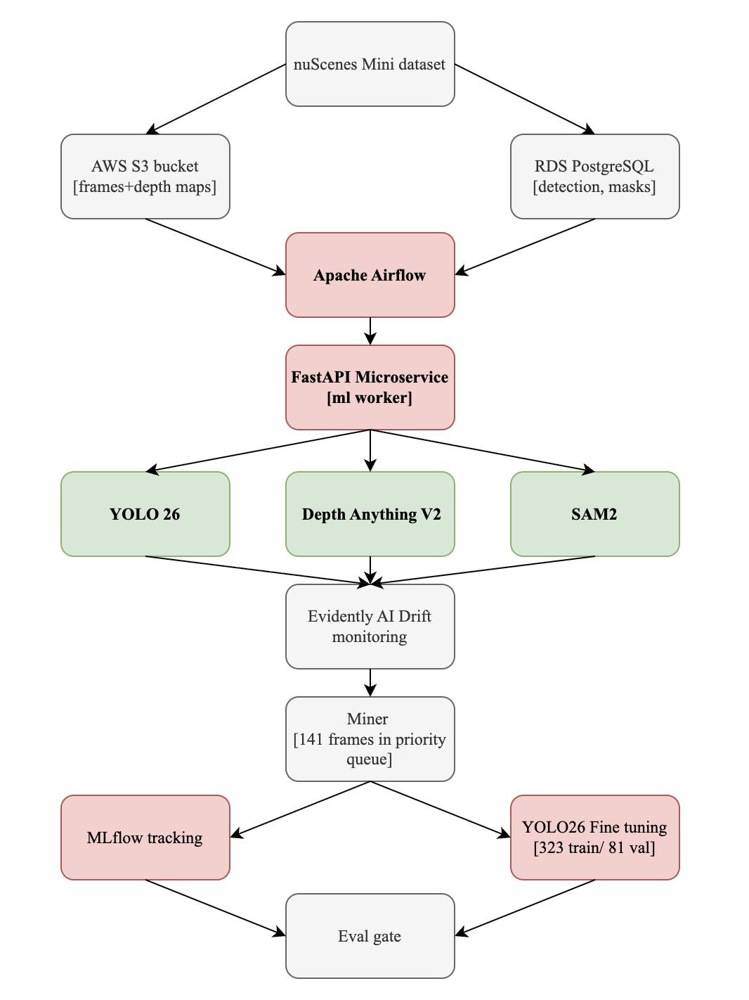
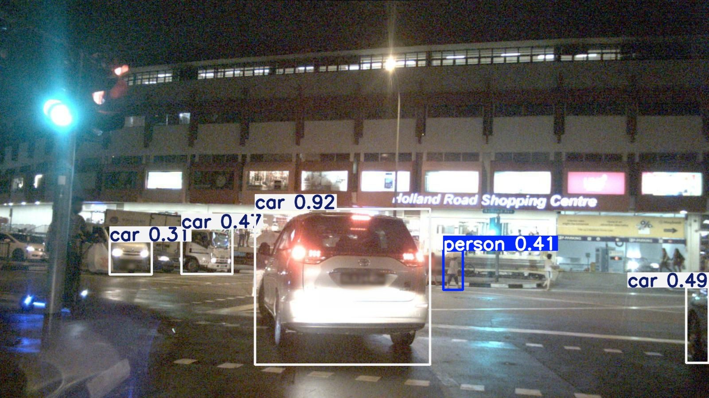
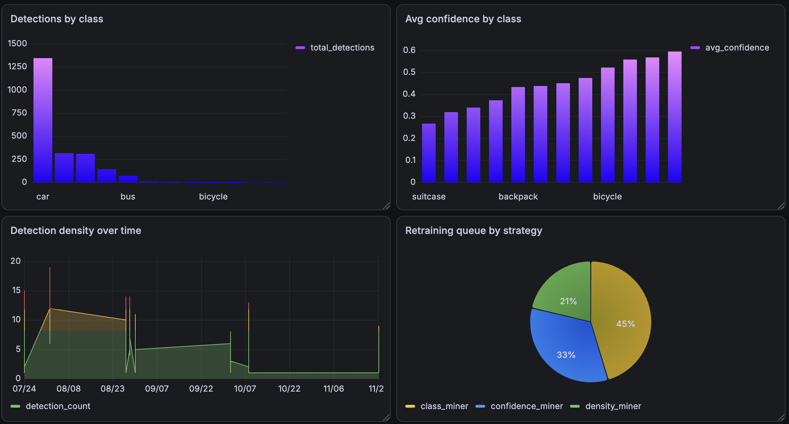
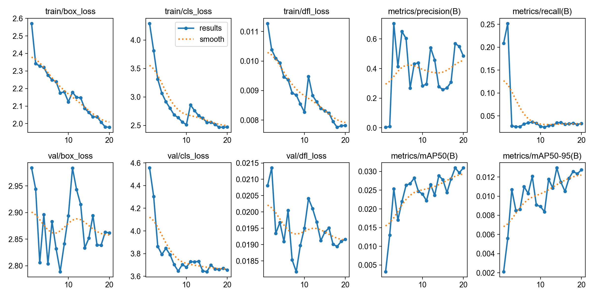

# perception-av

An end-to-end autonomous vehicle perception pipeline built on nuScenes sensor data. The system ingests front camera frames, runs three-stage inference, monitors model drift in production, and automatically triggers retraining when performance degrades.

I built this to get hands-on with the full lifecycle of a production ML system including model, data pipeline, orchestration, monitoring, and retraining loop that keeps it running.

---



---

## What it does

Frames from nuScenes flow through an Airflow-orchestrated pipeline running three inference services in parallel:

- **YOLO26** detects objects across 12 classes at 104ms per frame
- **Depth Anything V2** estimates monocular depth for each frame, stored as `.npy` in S3
- **SAM2** segments every detected object at pixel level, stored as RLE in PostgreSQL

An Evidently AI drift monitor watches confidence score distributions across frames. When drift is detected, a hard case miner identifies the frames most worth retraining on by prioritizing low-confidence detections, traffic light failures, and dense complex scenes. Those frames go into a retraining queue, the model fine-tunes on them, and an eval gate decides whether to promote the new weights.

---

## Results

| Metric | Value |
|--------|-------|
| Frames processed | 404 |
| Object detections | 2,221 |
| Depth maps | 404 |
| Instance masks | 1,889 |
| Hard case frames mined | 141 |
| Drift score | 0.75 (cross-scene variation) |
| Baseline mAP50 | 0.0082 |
| Fine-tuned mAP50 | 0.0288 (+251%) |
| Fine-tuned mAP50-95 | 0.0129 (+617%) |
| Training time | 11 min on Apple MPS |

Fine-tuning used an 80/20 train/val split (323 train, 81 held-out val frames). The mAP numbers are on unseen validation frames.

---

## Detection sample



---
## Grafana dashboard



Four panels connected to PostgreSQL via dbt analytics views: detection distribution by class, average confidence per class, detection density over time, and retraining queue breakdown by mining strategy.

## Training curves



---

## Stack

| Layer | Tools |
|-------|-------|
| Orchestration | Apache Airflow 2.9, CeleryExecutor, Redis |
| Inference | YOLO26, Depth Anything V2, SAM2 |
| Serving | FastAPI microservice (ml-worker container) |
| Storage | AWS S3, PostgreSQL RDS |
| Monitoring | Evidently AI |
| Experiment tracking | MLflow |
| Infrastructure | Docker Compose, 7 containers |
| Training | PyTorch, Apple MPS |

---

## Architecture

The ml-worker is a separate FastAPI container from Airflow. This keeps the Airflow image under 4GB; torch, SAM2, and transformers are live in the ml-worker image instead. Airflow tasks call `/detect`, `/depth`, and `/segment` via curl.

Retraining uses three mining strategies:
- **confidence miner**: frames where avg detection confidence < 0.4
- **class miner**: frames with traffic light confidence < 0.35 (safety-critical)
- **density miner**: frames with 8+ detections at borderline confidence

The eval gate requires traffic light confidence to improve by at least 0.02 before promoting a new model. Traffic lights have the lowest baseline confidence (0.451) and are safety-critical, so they drive the promotion decision.

---

### Prerequisites

- Docker Desktop
- AWS credentials with S3 and RDS access
- Python 3.11+
- nuScenes mini dataset

### Setup

```bash
git clone https://github.com/Prishita01/perception-av
cd perception-av
cd airflow && docker compose up -d
```

create an .env file for accessing the credentials.

### Running inference

```bash
python inference/detect.py
python inference/depth.py
python inference/segment.py
```

### Check drift

```bash
python monitoring/drift.py
```

### Fine-tune on hard cases

```bash
python training/convert_labels.py
python training/finetune.py
```

---

## Database schema

 `scripts/schema.sql` has Four tables: `frames`, `detections`, `masks`, `retraining_queue`. Detections reference frames, masks reference detections; delete masks before detections if you need to reset.

---

## Notes

nuScenes provides 3D bounding box annotations in world coordinates. `training/convert_labels.py` projects them to 2D image coordinates using camera intrinsics and ego pose transforms before converting to YOLO format.

Traffic light confidence (0.451 avg) was the weakest class across all detections; nuScenes doesn't annotate traffic lights, so the fine-tuning focused on the classes it does provide: pedestrians, vehicles, and traffic cones.
